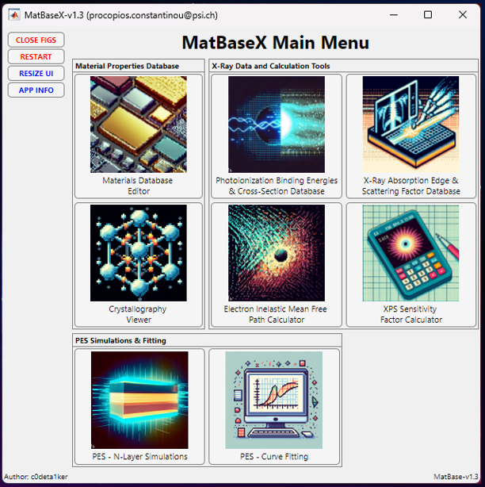
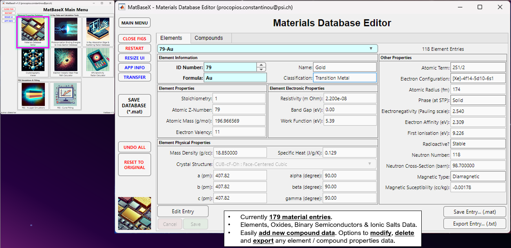
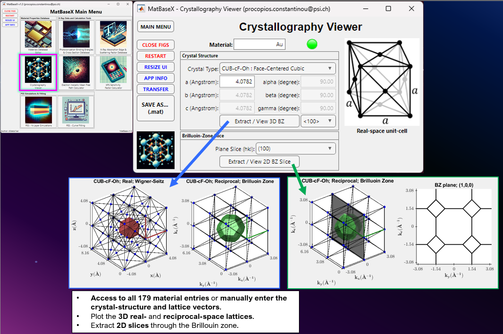
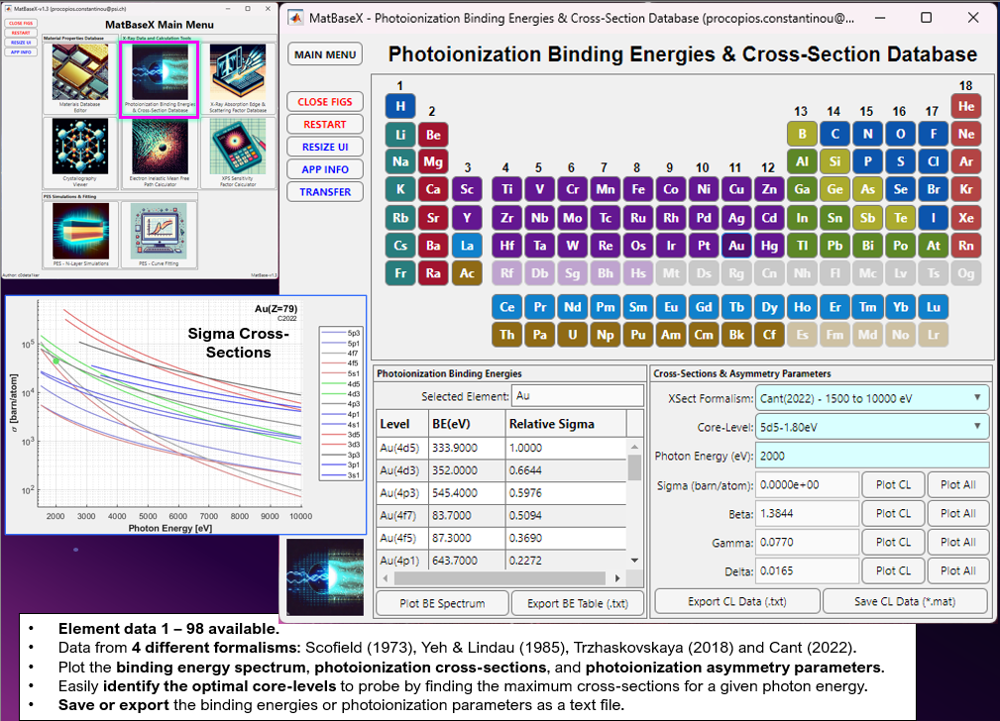
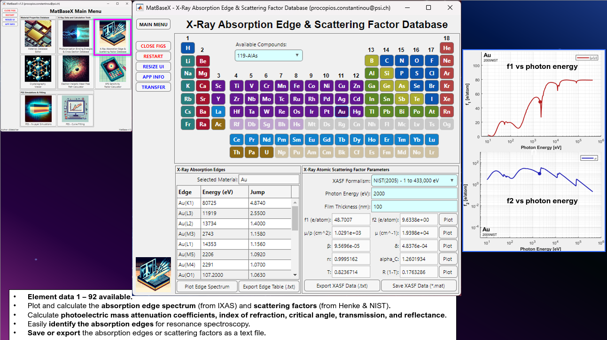
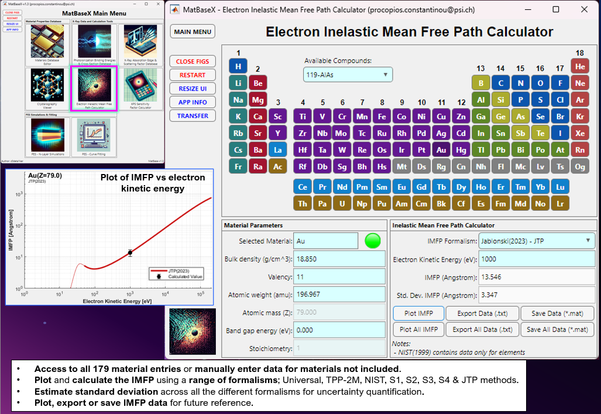
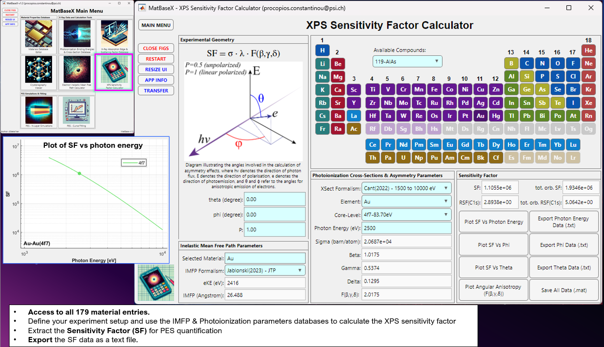
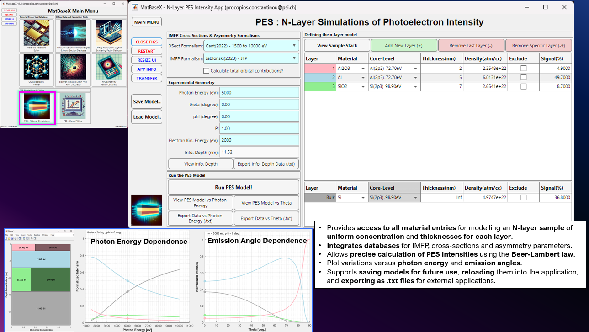
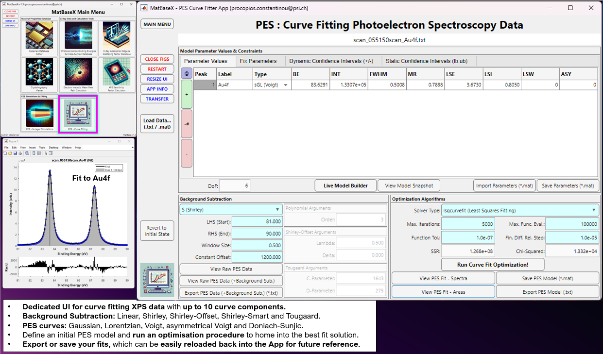

# MatBaseX: Comprehensive Materials and X-ray Interaction Database for Photoelectron Spectroscopy Analysis  

[MatBaseX](https://github.com/c0deta1ker/MatBaseX) is a comprehensive database and analytical tool tailored for photoelectron spectroscopy (PES) analysis, emphasizing the study of materials and their X-ray interactions. It seamlessly integrates calculators and databases into one platform, providing functionalities such as a Materials Properties Database for managing data, tools for analysing X-ray Photoionization Energies, Cross-Sections, and X-ray Absorption and Scattering Factors. These features help users very quickly identify which core-levels give the most intensity at a given photon energy (via cross-section maximisation) or locate absorption edges for resonance spectroscopy. It also includes calculators for electron inelastic mean free path (IMFP) determination using eight different formalisms, as well as an XPS Sensitivity Factor Calculator to support precise, quantitative PES analysis.     

Additional features include PES N-Layer Simulations, which utilizes the Beer-Lambert law to compute intensities for a user-defined heterostructure, and a PES Curve Fitting App that allows users to quickly load in experimental data (two-column text file containing binding energy and intensity values) and determine the best fit. By integrating all these advanced databases, calculators, and analytical tools, MatBaseX helps researchers streamline workflows and enhance the precision of their data analysis. [Download MatBaseX](https://github.com/c0deta1ker/MatBaseX/releases/download/v1.0/MatBaseX_Installer_Web.exe) today to explore its powerful capabilities!    

## Installation  
1. Download the *MatBaseX* repository.
2. Open MATLAB and use *Set Path* in the *Home* tab to add the *MatBaseX* repository and all its sub-folders into its saved search paths.
3. Make sure you also use *Set Path* to add the repository / folder that contains all of your data to be loaded in.
4. Type 'MatBaseX' in the MATLAB Command Prompt to boot up the Main Menu App.

Or, simply download & install the standalone app via the executable file [here](https://github.com/c0deta1ker/MatBaseX/releases/download/v1.0/MatBaseX_Installer_Web.exe)!

## Snapshot of MatBaseX Apps
**(1) MatBase Main Menu**: The main MATLAB App that provides seamless navigation to all other MATLAB apps using the comprehensive Materials Properties Database. Accessible in MATLAB by typing 'MatBaseX' in the command prompt.
  

**(2) Materials Database Editor**: Effortlessly manage the Materials Properties Database with this user-friendly app. Add, delete, and edit entries with ease, streamlining your workflow and enhancing the efficiency of other apps that utilize the database for calculations. Accessible in MATLAB via the MatBaseX Main Menu, or explicitly by typing 'MatBaseX_01_MaterialsDatabaseEditor'.
  

**(3) Crystallography Viewer**: View unit cells in both real and reciprocal space, calculate the Brillouin zone, and extract 2D slices for analysis. Conveniently access material parameters from the Materials Properties Database or manually enter data for materials not included in the database. Accessible in MATLAB via the MatBaseX Main Menu, or explicitly by typing 'MatBaseX_02_CrystallographyViewer'.
  

**(4) X-Ray Photoionization Binding Energy & Cross-Section Database**: Extract binding energy spectra, photoionization cross-sections, and asymmetry parameters for elements 1-98 using formalisms like Scofield (1973), Yeh & Lindau (1985), Trzhaskovskaya (2018), and Cant (2022). Identify the best core-levels to probe by finding maximum cross-sections.
   

**(5) X-Ray Absorption Edge & Scattering Factor Database**: Extract x-ray absorption edges and scattering factors for elements 1-92 and derived compounds using the Henke (1995) & NIST (2005) methods. Calculate photoelectric mass attenuation coefficients and determine material properties like index of refraction, critical angle, transmission, and reflectance. Identify optimal edges for resonance spectroscopy. 
   

**(6) Electron Inelastic Mean Free Path Calculator**: Calculate the electron inelastic mean free path (IMFP) using formalisms such as the Universal, Optical (NIST), TPP-2M, S1, S2, S3, S4, and JTP methods. Access material parameters from the Materials Properties Database or manually input data for materials not included in the database.
  

**(7) XPS Sensitivity Factor Calculator**: Integrates IMFP, photoionization cross-sections, and asymmetry databases. Customize experimental geometry, photon polarization, and formalisms for IMFP and cross-section determination. Select core-levels and generate sensitivity factor plots against photon energy and emission angle with a single click. Indispensable for precise, quantitative XPS analysis.  
  

**(8) PES - N-Layer Simulations**: Construct multi-layered models with uniform constant material concentration and thickness. Leverage the extensive database for material properties, IMFP parameters, photoionization cross-sections and asymmetry parameters. Accurately compute PES intensities using the Beer-Lambert law, modulated by electron IMFP based on your experimental setup. Graphically represent variations in photon energy and emission angles.   
       

**(9) PES - Curve Fitting**: Accurately peak fit your XPS/PES data. Construct initial models with various curve shapes (Gaussian, Lorentzian, Voigt, or Doniach-Sunjic). Manually define the binding energy, spin-orbit split components and branching ratios or type in the core-level of interest, and if it exists in the binding energy database, all these parameters will be loaded automatically. Subtract the background using Polynomial, Shirley, or Tougaard methods, and enter lower/upper bound estimates for fit parameters. Run optimization algorithms to achieve the best fit. Simple and efficient to use for fast peak fitting and chemical shift identification.
     

## MATLAB Version control  
MATLAB version:   2024b   
MATLAB add-ons (not required, but recommended): Curve Fitting Toolbox, Global Optimization Toolbox, Image Processing Toolbox, Optimization Toolbox.

## Authors
**Dr. Procopios Constantinou**,  
Swiss Light Source (SLS),  
Paul Scherrer Institute (PSI),  
email: procopios.constantinou@psi.ch

## Acknowledgments  
I would like to thank Dr. Vladimir Strocov (PSI) for his guidance and feedback regarding the software.  

## References & Sources

**Materials Properties Database**  
[[1](https://www.wolframalpha.com/)] _Electronegativity, electron affinity, ionisation energies, temperatures and crystal structures_   
[[2](https://www.schoolmykids.com/learn/periodic-table-of-elements/)] _Temperatures, crystal structures, unit cell parameters, electronic and magnetic properties_   
[[3](https://doi.org/10.1063/1.3253115/)] _Strehlow, W. H., and Earl L. Cook. "Compilation of energy band gaps in elemental and binary compound semiconductors and insulators." (1973): 163-200._   
[[4](https://en.wikipedia.org/)] _Band-gap estimates,  temperatures,  crystal structures,  unit cell parameters,  electronic and magnetic properties_   
[[5](https://pubchem.ncbi.nlm.nih.gov/)] _Atomic weights of elements and compounds_   

**Photoionization Energies, Cross-Sections & Asymmetry**  
Scofield Database (1973):  
[[6](https://doi.org/10.2172/4545040)] _Scofield, J. H. "Theoretical photoionization cross sections from 1 to 1500 keV"_   

Yeh & Lindau Database (1985):   
[[7](https://doi.org/10.1016/0092-640X(85)90016-6)] _Yeh, J. J., and I. Lindau. "Atomic subshell photoionization cross sections and asymmetry parameters: 1⩽ Z⩽ 103." Atomic data and nuclear data tables 32.1 (1985): 1-155_   

Moulder Binding Energies Database (1993):   
[[8](https://scholar.google.com/scholar_url?url=https://www.researchgate.net/profile/Akif-Zeb/post/How_can_I_evaluate_at_of_N_in_TiO2_using_XPS_technique/attachment/5f3ebac4ce377e00016e3bc5/AS%253A926669195993088%25401597946561045/download/MANXPS.pdf&hl=en&sa=T&oi=gsb-ggp&ct=res&cd=0&d=11053645406167494942&ei=Aw3XZr_mFv-Xy9YPgcCeoQo&scisig=AFWwaeajp-vE3wtFLu1NvP33L_uI)] _Moulder, John F. et al. “Handbook of X-Ray Photoelectron Spectroscopy.” (1992)._   

Trzhaskovskaya Database (2018-2019):    
[[9](https://doi.org/10.1016/j.adt.2017.04.003)] _Trzhaskovskaya, M. B., and V. G. Yarzhemsky. "Dirac–Fock photoionization parameters for HAXPES applications." Atomic Data and Nuclear Data Tables 119 (2018): 99-174._   
[[10](https://doi.org/10.1016/j.adt.2019.05.001)] _Trzhaskovskaya, M. B., and V. G. Yarzhemsky. "Dirac–Fock photoionization parameters for HAXPES applications, Part II: Inner atomic shells." Atomic Data and Nuclear Data Tables 129 (2019): 101280_   

Cant Database (2018-2019):    
[[11](https://doi.org/10.1002/sia.7059)] _Cant, David JH, et al. "Quantification of hard X‐ray photoelectron spectroscopy: Calculating relative sensitivity factors for 1.5‐to 10‐keV photons in any instrument geometry." Surface and Interface Analysis 54.4 (2022): 442-454_   

**X-Ray Absorption Edge & Scattering Factors Database Sources**  
Henke Database (1993):  
[[12](https://doi.org/10.1006/adnd.1993.1013)] _B. L. Henke, E. M. Gullikson, and J. C. Davis, Atomic Data and Nuclear Data Tables Vol. 54 No. 2 (July 1993)_    

NIST Database (2005):  
[[13](https://physics.nist.gov/PhysRefData/FFast/html/form.html)] _NIST Standard Reference Database 66, "Detailed Tabulation of Atomic Form Factors, Photoelectric Absorption and Scattering Cross Section, and Mass Attenuation Coefficients for Z = 1-92 from E = 1-10 eV to E = 0.4-1.0 MeV" (January 2005)_    

IXAS Database (2025):  
[[14](https://xraydb.xrayabsorption.org/element/)] _IXAS X-ray Data for the Elements_    

**Inelastic Mean-Free Path (IMFP) Sources**  
Universal (1979):    
[[15](http://dx.doi.org/10.18434/T48C78)] _Seah, M. Pl, and W. A. Dench. "Quantitative electron spectroscopy of surfaces: A standard data base for electron inelastic mean free paths in solids." Surface and interface analysis 1.1 (1979): 2-11_  

TPP-2M Formalism (1994):      
[[16](https://doi.org/10.1002/sia.740010103)] _Tanuma, Shigeo, Cedric J. Powell, and David R. Penn. "Calculations of electron inelastic mean free paths. V. Data for 14 organic compounds over the 50–2000 eV range." Surface and interface analysis 21.3 (1994): 165-176_  
[[17](https://doi.org/10.1002/sia.1526)] _Tanuma, Shigeo, Cedric J. Powell, and David R. Penn. "Calculation of electron inelastic mean free paths (IMFPs) VII. Reliability of the TPP‐2M IMFP predictive equation." Surface and interface analysis 35.3 (2003): 268-275_    
[[18](https://doi.org/10.1002/sia.4816)] _Seah, M. P. "An accurate and simple universal curve for the energy‐dependent electron inelastic mean free path." Surface and interface analysis 44.4 (2012): 497-503_    
[[19](https://doi.org/10.1002/sia.3522)] _Tanuma, Shigeo, C. J. Powell, and D. R. Penn. "Calculations of electron inelastic mean free paths. IX. Data for 41 elemental solids over the 50 eV to 30 keV range." Surface and interface analysis 43.3 (2011): 689-713_    

NIST Electron IMFP Database (1999):     
[[20](http://dx.doi.org/10.18434/T48C78)] _NIST Standard Reference Database 71_

S1 & S2 Formalism (2011):     
[[21](https://doi.org/10.1002/sia.4816)] _Seah, M. P. "An accurate and simple universal curve for the energy‐dependent electron inelastic mean free path." Surface and interface analysis 44.4 (2012): 497-503_    

S3 & S4 Formalism (2012):    
[[22](https://doi.org/10.1002/sia.5033)] _Seah, M. P. "Simple universal curve for the energy‐dependent electron attenuation length for all materials." Surface and interface analysis 44.10 (2012): 1353-1359_   

JTP Formalism (2023):    
[[23](https://doi.org/10.1002/sia.7217)] _Jablonski, Aleksander, Shigeo Tanuma, and Cedric J. Powell. "Calculations of electron inelastic mean free paths (IMFPs). XIV. Calculated IMFPs for LiF and Si3N4 and development of an improved predictive IMFP formula." Surface and Interface Analysis 55.8 (2023): 609-637_   

**Useful PES Quantification Literature**  
[[24](https://doi.org/10.1016/0009-2614(76)80496-4)] _Hill, J. M., et al. "Properties of oxidized silicon as determined by angular-dependent X-ray photoelectron spectroscopy." Chemical Physics Letters 44.2 (1976): 225-231_   
[[25](https://doi.org/10.1002/sia.5934)] _Walton, J., et al. "Film thickness measurement and contamination layer correction for quantitative XPS." Surface and Interface Analysis 48.3 (2016): 164-172_   
[[26](https://doi.org/10.1116/1.5141395)] _Shard, Alexander G. "Practical guides for x-ray photoelectron spectroscopy: Quantitative XPS." Journal of Vacuum Science & Technology A 38.4 (2020)_   

**Useful Websites for XPS Information & Application Notes**    
[[27](https://srdata.nist.gov/xps/)] NIST X-ray Photoelectron Spectroscopy Database  
[[28](https://www.xpsfitting.com/search/label/About%20This%20Site)] Surface Science Western laboratories (XPS Reference Pages)  
[[29](https://www.xpsdata.com/xpsdata.htm)] XPS Information and Application Notes   
[[30](https://xpsdatabase.net/)] B. Vincent Crist: International XPS Database  
[[31](https://xpslibrary.com/)] B. Vincent Crist: XPS Information and Application Notes  
[[32](https://a-x-s.org/research/cross-sections/)] A. Regoutz: Source of the Digitized Photoionization Parameters  

## License  
This project is licensed under the GNU General Public License v3.0 - see the [LICENSE.md](LICENSE.md) file for details.

--PCC, April 2025